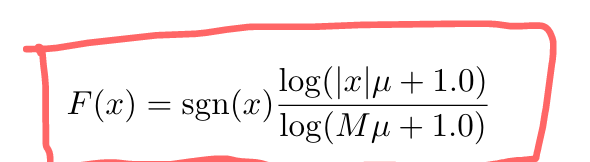

# A Generalist Agent
## Key Points
- similar language modelling framework, self-attention only architecture, pure offline supervised learning
- multi-modal, multi-task, multi-embodiment,  single net, same weight  
- trained on 640 distinct tasks with varying modalities, obs, action specs
- model & data & compute scaling 
- NOT about excelling at certain/all tasks. It is about generally capable on A LARGE NUMBER of tasks

## Model
### Tokenization
- Text: SetencePiece, vocab size: 32000
- Images: into sequence of 16*16 patches, non-overlapping, in raster order. pixel normalization ([-1,1] + / sqrt(patch size))
- Discrete values: sequence of integers in row-major order, vocab size: 1024
- Continuous values: sequence of floating pts in row-major order. Mu-law encoded into [-1,1] --> discreted to 1024 bins. 
### Ordering
### Embedding
- Text, discrete, continues values: lookup table + local positional embedding @ same time step
- Images: resnet + within image positional embedding

## Training
- only predict text, discrete & continuous values
- parameters: embedding function + transformer
- 1.2B parameters, 24 layers, embedding size 2048, ff hidden size 8196
- prompt conditioning (same source agents on same task) to distinugish tasks, 25% of sequence in each batch (50% as goal conditioning, 50% uniform sampled from the episode  in evaluation uses a successful demonstration ) (could this be a restriction?)
- batch size = 512, sequence len = 1024 (randomly sampled subsequences), 4 days 
- data balancing per batch 

## Data
 need further understanding 
85% control tasks + 15% vision/language tasks
- simulated control tasks: generated by SOTA/near SOTA RL agents while it is training, beneficial to train on high return episodes
- vision/ language: text only, vision-language datasets, vqa. sample 5 image-text pairs in 1 training episode (I am confused about this part as how these pairs can form a causal sequence?)
- robotics (sim & real): not sure 

## Results
- pretrain, scaling law: in distribution performance scales well with increased model size
- pretrain + finetune, out of distribution:  
different for image/non-image based environment
    - all data
    - same domain only data
    - no control data
    - no pretrain  
- ...

## Insights/ Observations
-  ablations on robotic task suggest that GATO may not be using the representations learned from the text-based datasets when adapting to robotics tasks.
- embeddings from the same tasks are clustered together. task clusters from the same domain and modality are located close to each other
- few shot out of distribution task learning

## Questions/Thoughts
- LM-like architecture for various task (language, vision, control). (pix2seq, decision tranformer, etc.)
- limitations on context length, prompt context
- cannot do real-time implementation on real robot
- many tricks for robotics tasks.

## Implementation Details
- Mu-law encoding

- temporal & spatial positional embedding
  - for patch, separate row/column indexing
- first transformer layer attention viz

## References
[1] https://arxiv.org/abs/2205.06175